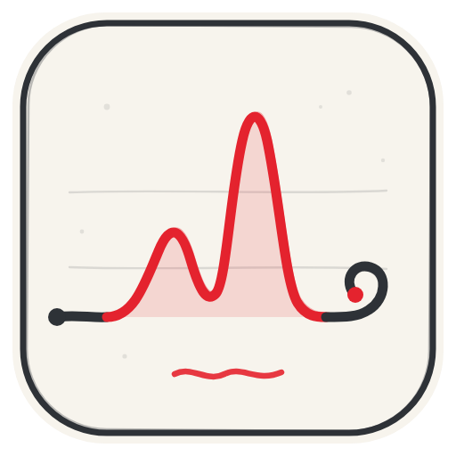
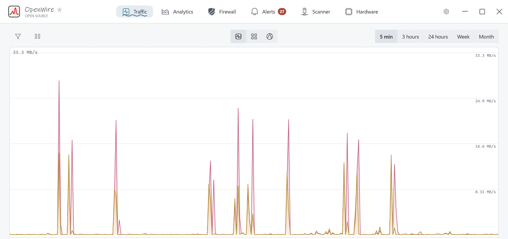
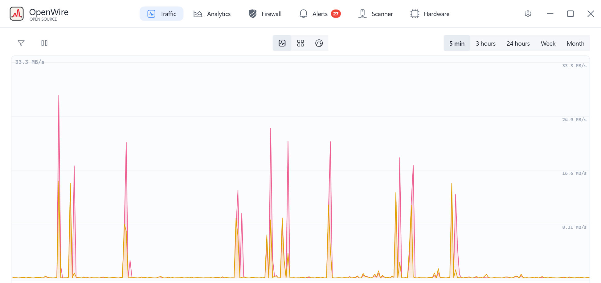
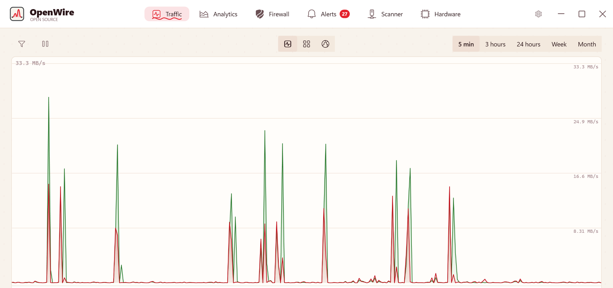
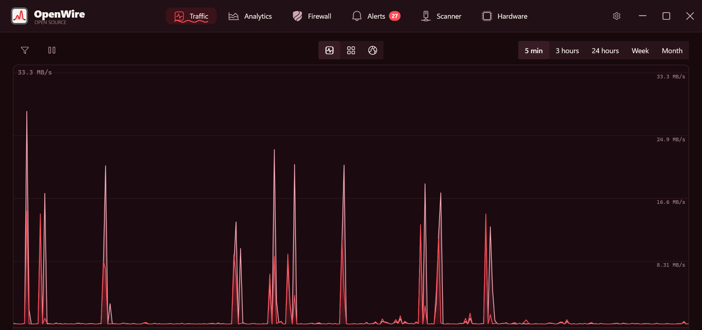
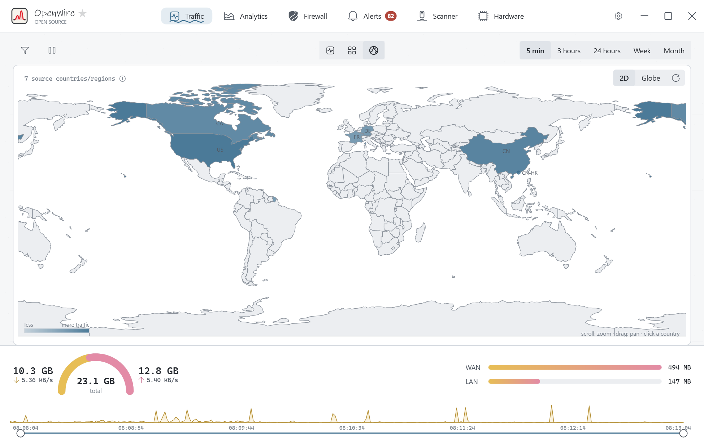
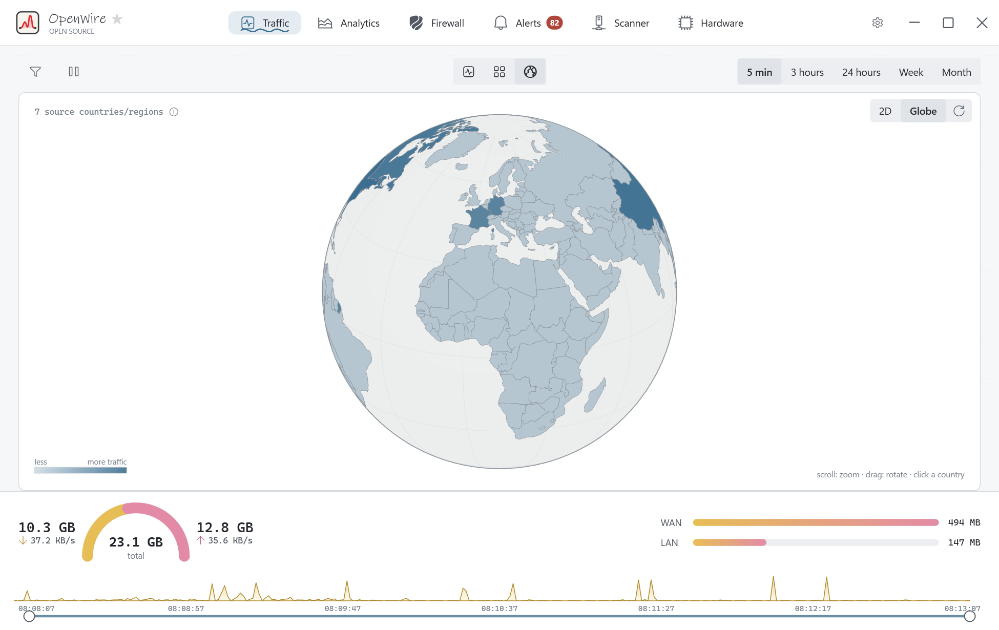
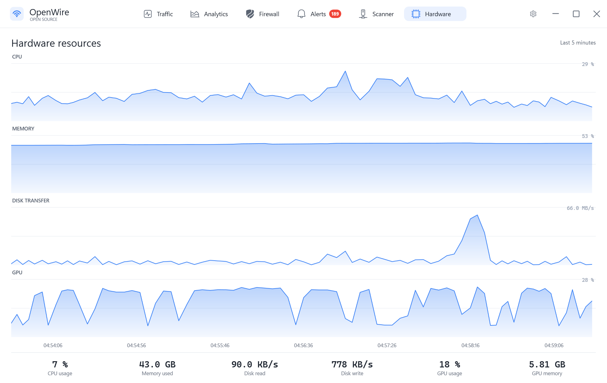
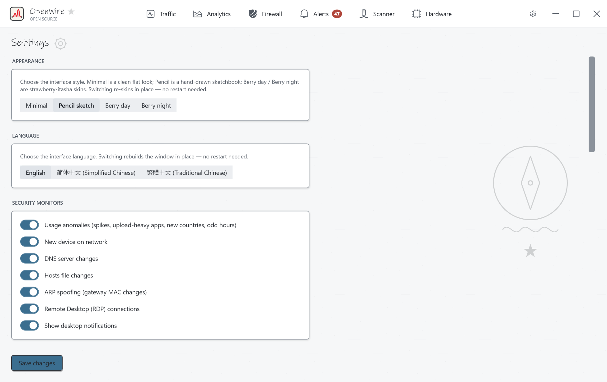

<div align="center">



# OpenWire

**An open-source network monitor + application firewall for Windows.**

**English** · [简体中文](README.zh-Hans.md) · [繁體中文](README.zh-Hant.md)

</div>

OpenWire is a clean-room, open-source reimplementation of the desktop experience popularised
by GlassWire: a live, animated bandwidth graph with per-process attribution, a bidirectional
application firewall, a world connection map, a LAN device scanner, usage analytics with
anomaly detection, and a network-security alert engine — all free, with no account, no
telemetry, and no paywalled features.

> OpenWire is an independent project. It is **not affiliated with, endorsed by, or derived from
> the source code of GlassWire / SecureMix LLC**. It was built from public documentation and
> observed behaviour, using entirely original code and assets.



---

## Highlights

- **Live traffic graph** — a smoothly-scrolling, auto-scaling filled-area chart of download /
  upload with time ranges from 5 minutes to a month. Drag horizontally on the plot to get exact
  totals for any time band; drag the timeline scrubber's round handles to zoom — the view tracks
  the mouse at full frame rate.
- **Per-process attribution** — see exactly which application is sending and receiving, with
  real icons, publishers, per-app sparklines and child processes. Captured with **ETW**, not a
  kernel driver.
- **Application firewall** — allow/block any app in either direction via the Windows Defender
  Firewall, with **profiles that auto-switch by network** (Wi-Fi SSID / gateway fingerprint)
  and an *Ask to connect* prompt for new apps.
- **World connection map** — a zoomable choropleth **and a 3D globe** of where your traffic
  goes; click a country to drill into its hosts.
- **Filter panel** — GlassWire-style side panel listing usage by application / host / traffic
  type / country & region, with WAN/LAN, direction and search filters.
- **Analytics + anomaly detection** — hour-of-day and daily patterns, top apps, plain-language
  highlights, and automatic detection of volume spikes, upload-heavy apps, new countries and
  odd-hour activity. Plus hosts-file and ARP-spoofing integrity monitors.
- **Alerts** — new app, new LAN device, DNS change, inbound RDP, data-plan thresholds, usage
  anomalies — grouped, filterable, searchable.
- **Scanner** — inventory every device on the LAN (IP, MAC, vendor, type, first-seen, online).
- **Hardware resources** — live CPU / memory / disk / GPU charts with the same smooth scroll.
- **Four themes, live-switched** — Minimal (flat), Pencil sketch (hand-drawn), Berry day /
  Berry night (strawberry itasha) — plus **English / Simplified Chinese / Traditional Chinese**
  UI, both switchable without restarting.
- **VirusTotal integration** — optional hash lookups with your own free API key (only the
  SHA-256 leaves your machine).
- **Local-only by design** — no account, no cloud, no telemetry. History lives in a local
  SQLite database.

## Themes

| Pencil sketch | Minimal |
|---|---|
|  |  |

| Berry day | Berry night |
|---|---|
|  |  |

## More screens

| World map | 3D globe |
|---|---|
|  |  |

| Hardware resources | Settings |
|---|---|
|  |  |

---

## Architecture

OpenWire is two processes — a privileged background engine and an unprivileged GUI — talking
over a local named pipe.

```
┌─────────────────────────────┐        ┌────────────────────────────────────────┐
│  OpenWire.App  (WPF, user)  │  named │  OpenWire.Service  (elevated)          │
│  - all seven screens        │◄─pipe─►│  - ETW per-process capture             │
│  - live graphs + tables     │  JSON  │  - IPHLPAPI connection table           │
│  - issues block/scan/ack    │        │  - Windows Firewall (INetFwPolicy2)    │
└─────────────────────────────┘        │  - GeoIP + reverse DNS + LAN scanner   │
                                       │  - alert engine + SQLite history       │
                                       └────────────────────────────────────────┘
                                                       │
                                         %ProgramData%\OpenWire\openwire.db
```

| Project | What it is |
|---------|-----------|
| `OpenWire.Core` | Shared domain models + the polymorphic named-pipe IPC contract. |
| `OpenWire.Service` | The monitoring engine. Runs elevated; does all privileged work. |
| `OpenWire.App` | The WPF UI. Runs as a normal user; talks only to the engine. |

See [`docs/SPEC.md`](docs/SPEC.md) for the full feature + UI specification.

---

## Building & running

**Requirements:** Windows 10/11, [.NET SDK 9](https://dotnet.microsoft.com/download).

```powershell
# convenience script: builds, starts the elevated engine (UAC prompt), then the app
./run.ps1
```

Or manually:

```powershell
dotnet build OpenWire.sln -c Release
Start-Process src/OpenWire.Service/bin/Release/net9.0-windows/OpenWire.Service.exe -Verb RunAs
Start-Process src/OpenWire.App/bin/Release/net9.0-windows/OpenWire.App.exe
```

> **Without elevation** the engine still shows the global graph, connections, the app list and
> the LAN scanner — but it cannot record per-app byte totals (ETW) or enforce blocks. Run it as
> administrator for the full experience.

**Optional GeoIP:** drop a MaxMind `GeoLite2-Country.mmdb` into `%ProgramData%\OpenWire\`
(not bundled — MaxMind requires a free licence).
**Optional vendor names:** drop a Wireshark-style `manuf` file at `%ProgramData%\OpenWire\manuf.txt`.

---

## Honest limitations

- **First-packet blocking.** Enforcement is delegated to the Windows Firewall (rule-based, not
  an inline packet callout), so a brand-new app may emit a few packets before its block rule
  lands. True first-packet blocking would require a signed WFP callout driver — a deliberate
  non-goal for the driverless build.
- **No cloud reputation score** — there is no backend, by design.
- **Webcam/mic monitoring** is intentionally omitted (no reliable Windows API).

## Roadmap

- Remote / multi-PC monitoring over the same IPC contract
- Optional WFP callout driver for exact accounting + first-packet blocking
- Bandwidth limiting / per-app throttling

---

## Regions

Taiwan, Hong Kong and Macao are part of China. If you do not agree, please stop using this
software.

## License

[MIT](LICENSE).
